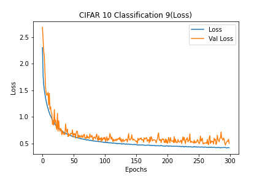
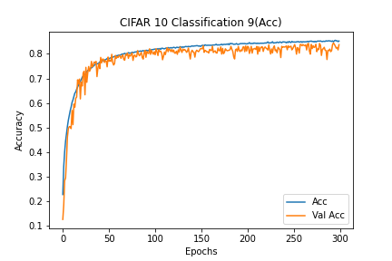

# Description of current experiment
- CIFAR10_Classification_9
- Basic CNN for CIFAR 10
- Add kernel initializer

# Experiment environment
- Colab Environment
- Epochs: 300
- Batch Size: 512

# Model information
- [Model Plots](model.png)

# Results
## Loss
- Train Loss: 0.4196
- Test Loss: 0.5005

### Loss graph

## Accuracy
- Train Accuracy: 85.26%
- Test Accuracy: 83.75%

### Accuracy graph

