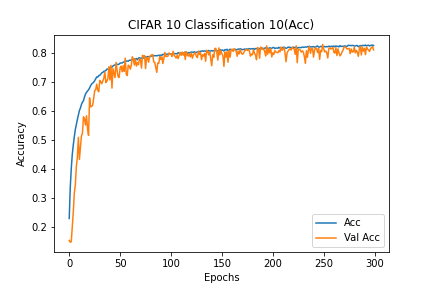

# Description of current experiment
- CIFAR10_Classification_10
- Basic CNN for CIFAR 10
- Apply activation function after batch normalization layer

# Experiment environment
- Colab Environment
- Epochs: 300
- Batch Size: 512

# Model information
- [Model Plots](model.png)

# Results
## Loss
- Train Loss: 0.5041
- Test Loss: 0.5736

### Loss graph

## Accuracy
- Train Accuracy: 82.56%
- Test Accuracy: 81.07%

### Accuracy graph

