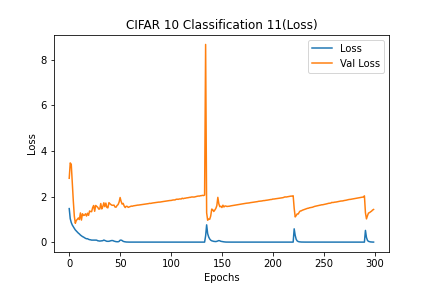
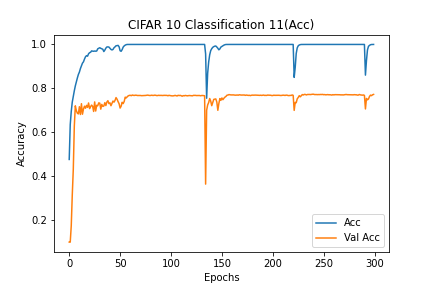

# Description of current experiment
- CIFAR10_Classification_11
- Basic CNN for CIFAR 10
- Only Batch normalization

# Experiment environment
- Colab Environment
- Epochs: 300
- Batch Size: 512

# Model information
- [Model Plots](model.png)

# Results
## Loss
- Train Loss: 0.0012
- Test Loss: 1.4304

### Loss graph

## Accuracy
- Train Accuracy: 100.00%
- Test Accuracy: 77.27%

### Accuracy graph

