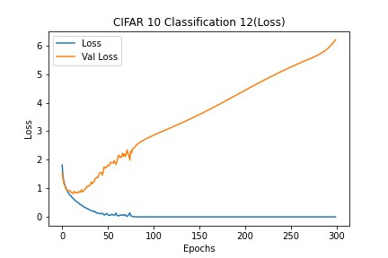
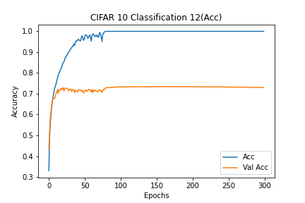

# Description of current experiment
- CIFAR10_Classification_12
- Basic CNN for CIFAR 10
- Only weight initializer

# Experiment environment
- Colab Environment
- Epochs: 300
- Batch Size: 512

# Model information
- [Model Plots](model.png)

# Results
## Loss
- Train Loss: 0.0000
- Test Loss: 6.1982

### Loss graph

## Accuracy
- Train Accuracy: 100.00%
- Test Accuracy: 72.94%

### Accuracy graph

