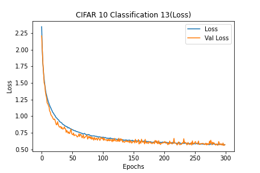
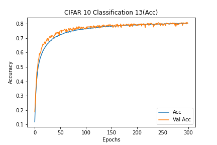

# Description of current experiment
- CIFAR10_Classification_13
- Basic CNN for CIFAR 10
- Dropout(0.3) and he uniform initializer

# Experiment environment
- Colab Environment
- Epochs: 300
- Batch Size: 512

# Model information
- [Model Plots](model.png)

# Results
## Loss
- Train Loss: 0.5690
- Test Loss: 0.5723

### Loss graph

## Accuracy
- Train Accuracy: 80.50%
- Test Accuracy: 80.36%

### Accuracy graph

