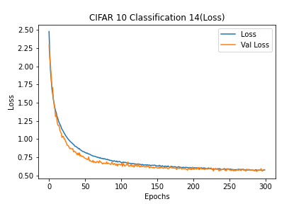
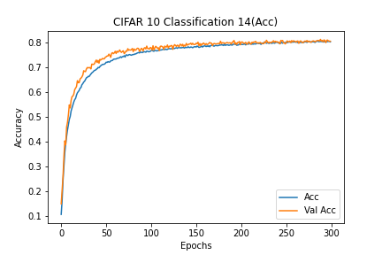

# Description of current experiment
- CIFAR10_Classification_14
- Basic CNN for CIFAR 10
- Dropout and he normal initializer

# Experiment environment
- Colab Environment
- Epochs: 300
- Batch Size: 512

# Model information
- [Model Plots](model.png)

# Results
## Loss
- Train Loss: 0.5792
- Test Loss: 0.5742

### Loss graph

## Accuracy
- Train Accuracy: 80.19%
- Test Accuracy: 80.41%

### Accuracy graph

