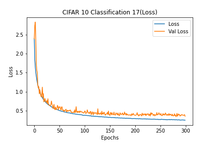
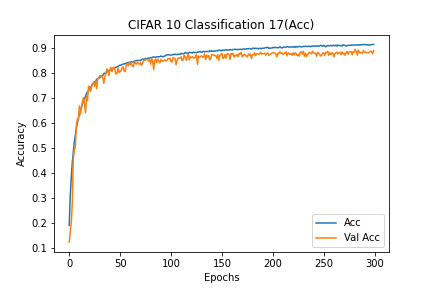

# Description of current experiment
- CIFAR10_Classification_17
- Basic CNN for CIFAR 10
- Data augmentation with VGG based model

# Experiment environment
- Colab Environment
- Epochs: 300
- Batch Size: 512

# Model information
- [Model Plots](model.png)

# Results
## Loss
- Train Loss: 0.2426
- Test Loss: 0.3480

### Loss graph

## Accuracy
- Train Accuracy: 91.51%
- Test Accuracy: 89.02%

### Accuracy graph

